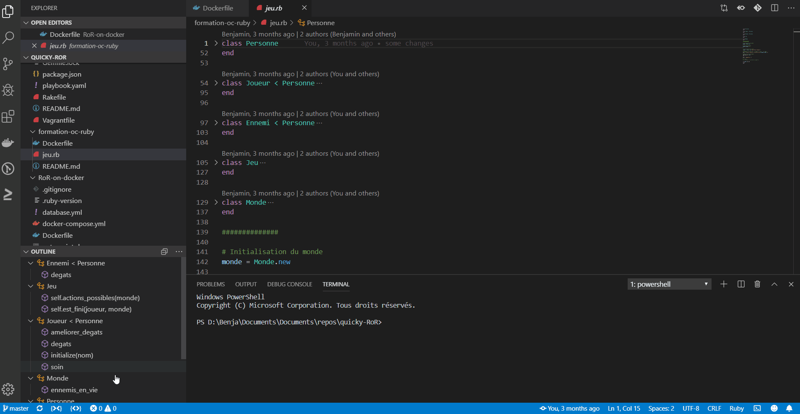

# fold-unfold-all-icone README
Just add a fold and a unfold button in the status bar (at the bottom left).

[vscode marketplace](https://marketplace.visualstudio.com/items?itemName=FerrierBenjamin.fold-unfold-all-icone)